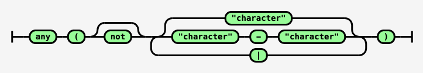

# Characters

These patterns match specific characters and fall into several groups:

- character literals
- character classes
- character shorthands
- any character
- non-printable characters
- metacharacters
- quotation marks

All represent consuming characters and can therefore be quantified, except `word_boundary` and `not_word_boundary`.

## Character Literals

The pattern `"<character>"` matches a character, e.g., `"q"` matchines the letter 'q'.
Character patterns represented this way are restricted to the printable characters.

As a convenience, multi-character strings may also be represented this way, e.g., `"foo"`.

## Character Classes

TODO




## Character Shorthands

These are four pairs of character shorthands along with their default regex translation (in Python):

| Word | Translation |
|------|-------------|
| digit() | \\d |
| not_digit() | \\D |
| word_character() | \\w |
| not_word_character() | \\W |
| whitespace() | \\s |
| not_whitespace() | \\S |
| word_boundary() | \\b |
| not_word_boundary() | \\B |

## Any Character

This predicate matches any character:

| Word | Translation |
|------|-------------|
| any_character() | . |

## Non-printable Characters

These predicates match non-printable characters:

| Word | Translation |
|------|-------------|
| bell() | \\a |
| escape() | \\e |
| form_feed() | \\f |
| newline() | \\n |
| carriage_return() | \\r |
| horizontal_tab() | \\t |
| vertical_tab() | \\v |

## Metacharacters

These predicates match the regex metacharacters:

| Word | Translation |
|------|-------------|
| dollar_sign() | \\$ |
| left_paren() | \\( |
| right_paren() | \\) |
| asterisk() | \\* |
| plus_sign() | \\+ |
| period() | \\. |
| question_mark() | \\? |
| left_bracket() | \\[ |
| right_bracket() | \\] |
| caret() | \\^ |
| left_brace() | \\{ |
| right_brace() | \\} |
| pipe() | \\| |

## Quotation Marks

Finally, because character literals are quoted, these two predicates match single and double 
quotation marks.

| Word | Translation |
|------|-------------|
| single_quote | ' |
| double_quote | " |

This allows you to match the characters f, o, o quoted like this:

```
double_quote()
"foo"
double_quote()
```